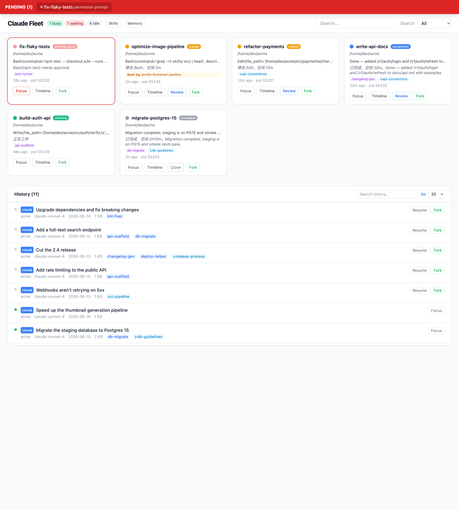
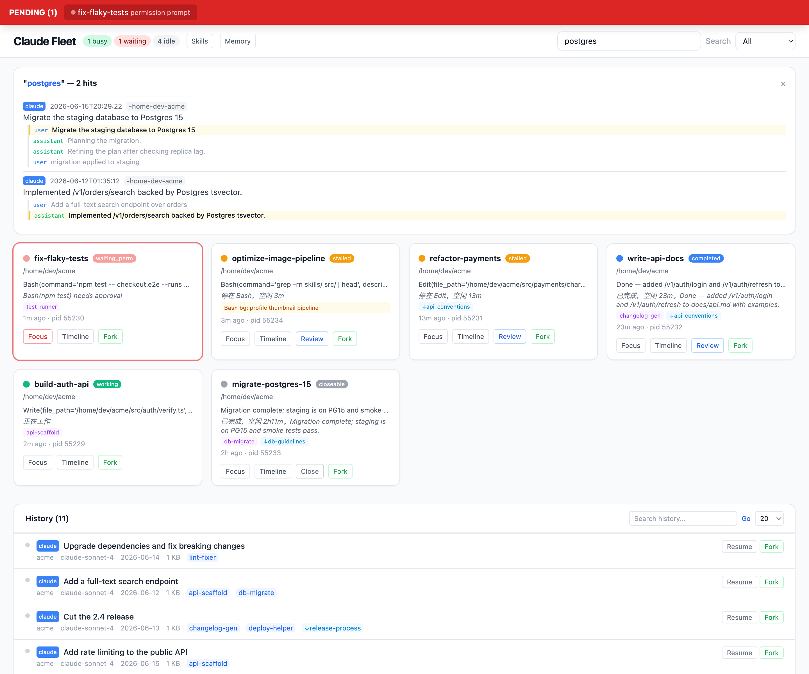
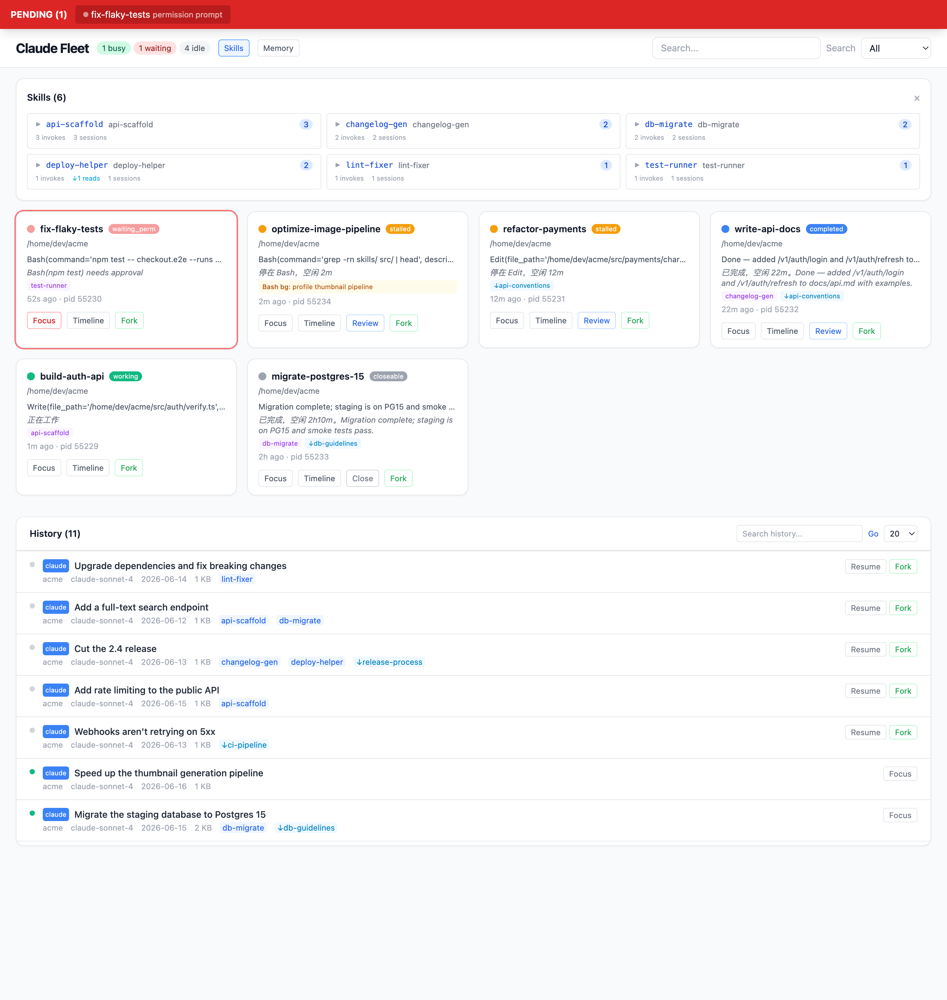
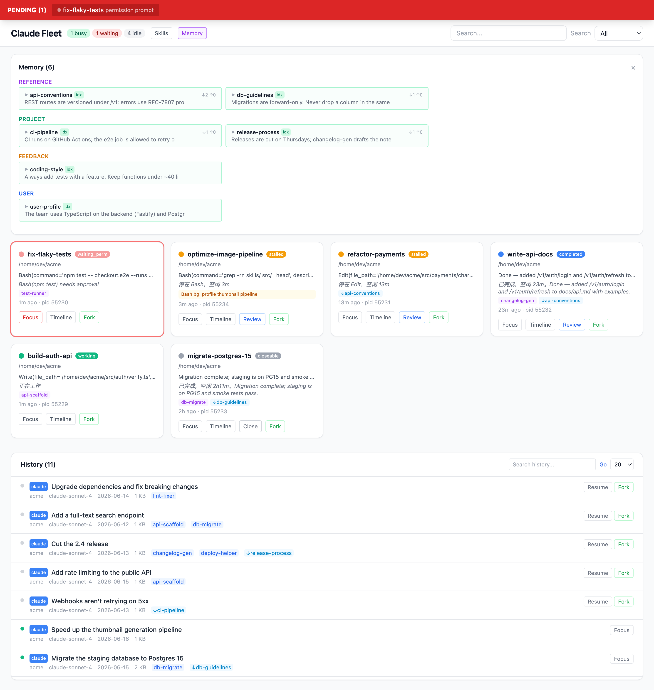
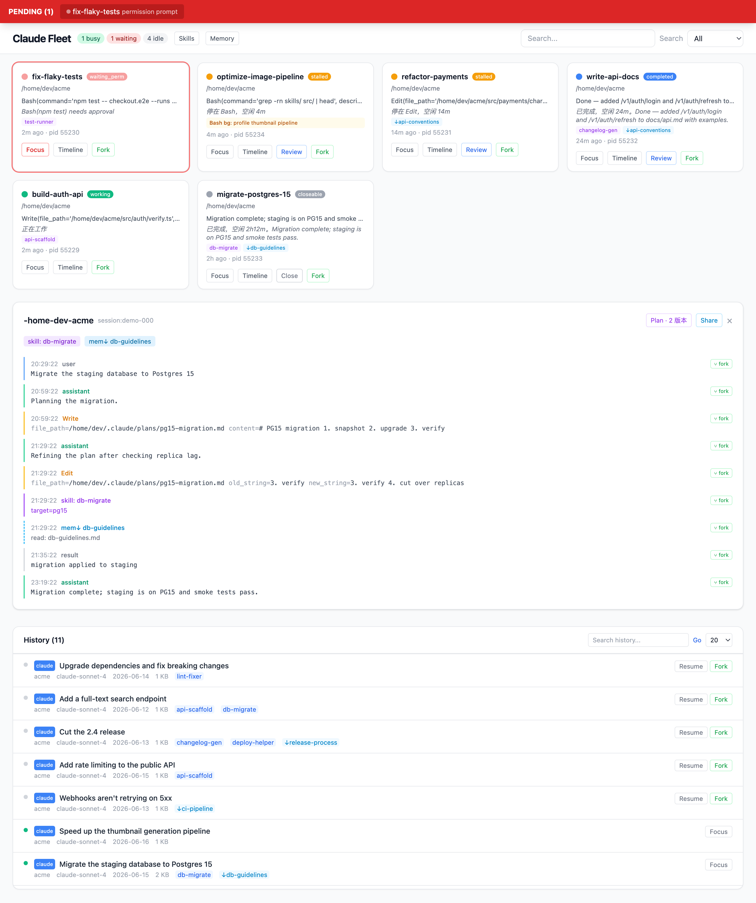
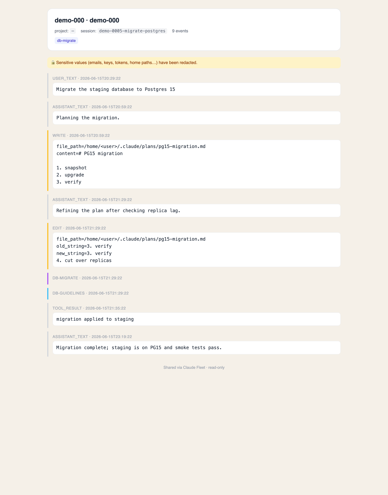

English | [中文](README.zh-CN.md)

# Claude Fleet

When you're vibe coding with 5–7 Claude Code windows open at once, you need one
place to see what every window is doing — who's stuck, who's waiting on you, who's
done.



## Run it in 30 seconds

```bash
git clone https://github.com/tianyilt/claude-fleet
cd claude-fleet && bash run.sh
# open http://127.0.0.1:7878 in your browser
```

The first run creates a venv and installs dependencies automatically — nothing to set up.

## Install options

**Run as a macOS app (recommended on Mac).** A signed, double-clickable `.app`:

```bash
./scripts/build-app.sh --install      # builds + copies to /Applications
```

Resume/Fork open a new terminal via `open -a` (LaunchServices) — no Automation
permission needed, so they work even after a restart. **Focus** (raising the tab
that owns a session) does use AppleScript; the first time you use it, approve
**“Claude Fleet” wants to control “iTerm.app”** — the signed app makes that grant
stick. For development with hot-reload, use `./run.sh`.

**Run anywhere (Windows / Linux).** The dashboard, history, search and monitoring
are cross-platform:

```bash
pip install -e .
./run.sh        # macOS/Linux
run.bat         # Windows
```

Resume/Fork open a real terminal on macOS (`open -a`) and Linux (gnome-terminal /
konsole / kitty / wezterm / xterm …; set `CLAUDE_FLEET_TERMINAL_CMD` to force one),
for both **Claude and Codex** sessions. On Windows (or any host without a known
launcher) they copy the `claude --resume …` command to your clipboard to paste
into your own terminal. **Focus** is macOS-only.

**Releases.** Tagged releases ship three artifacts: `claude-fleet-macos-app.zip`
(double-clickable app), `claude-fleet-src.tar.gz` (run anywhere), and
`claude-fleet-windows.zip`.

## What it solves

The everyday pain of multi-window vibe coding:

- **Permission prompts flash by and you miss them** → a persistent red bar at the top; click it to jump back to that terminal.
- **You don't know what each window is doing** → every card shows the current task, triage status, and background jobs.
- **Finished windows get left open** → the patrol engine marks them `closeable`; close with one click.
- **You can't find that session from last week** → full-text search returns in ~50ms with VS Code–style match context.
- **You don't know how much a skill actually gets used** → 3-dimensional stats (invokes + file read/write + bash references).
- **You don't know who touched a memory** → in-degree (↓ sessions that read it) + out-degree (↑ sessions that wrote it).

## Core features

### Triage classification

Not a simple busy/idle flag. The patrol engine reads each transcript's
`stop_reason`, `queue-operation` events, and background-task state:

| Status | Meaning | How it's decided |
|--------|---------|------------------|
| 🟢 working | actively working | busy, or has a live Monitor/Bash background task |
| 🔴 waiting | waiting on you | permission prompt / dialog open |
| 🟡 stalled | stuck | stop_reason=tool_use + idle > 5 min |
| 🔵 completed | done | stop_reason=end_turn + idle > 5 min |
| ⚪ closeable | safe to close | completed + idle > 1 h |

Background tasks (`Bash run_in_background`, `Monitor persistent`) are tracked by
pairing tool_use/tool_result; finished ones are cleared automatically, so they
don't get misread as `working`.

### Search

ripgrep across all Claude + Codex transcripts, ~50ms. It doesn't just search
session titles — searching "hailuo" finds a session that mentioned Hailuo in the
conversation, even if the title is "you should check klingai.com".

Each result carries up to 3 match-context snippets so you can see at a glance why
it matched.



### Skill / memory tracking

The skill panel reports three dimensions:

```
paper2video        333   1 invoke · ↓122 reads · ↑53 writes · 157 bash
feishu-notify       45  24 invokes · ↓7 reads · ↑7 writes · 7 bash
qzcli-topdowneval   12   3 invokes · ↓1 reads · ↑2 writes · 6 bash
```

If you only counted formal `/skill-name` invocations you'd get 44; adding
Read/Write/Edit of skill files plus Bash references to `skills/` brings the real
total to 431.

The memory panel groups by type (user / feedback / project / reference) and shows
`↓3 ↑2` per entry (read by 3 sessions, modified by 2).




### Timeline + plan history

Open any session to see the full conversation flow. Skill calls are purple,
memory reads are dashed blue, memory writes are pink.

Plan version history: a session typically iterates on its plan 5–14 times — each
Write is a full snapshot, each Edit is a red/green diff.

Every event has a **⑂ fork** button, and the header has a **Share** button (below).



### Fork from any node

Don't just resume the latest state — branch from *any* point in a long
conversation. Click **⑂ fork** on a timeline event and Claude Fleet copies the
transcript truncated at that node into a new session (rewriting the session id)
and resumes it, so you continue from there with the earlier history but none of
the later turns. *(Requested in [#3](https://github.com/tianyilt/claude-fleet/issues/3).)*

For long sessions, you don't have to scroll to find the right node: the **Plan
history** panel anchors to each plan version — **↳ jump** scrolls the timeline to
where that plan was written, and **⑂ fork (done)** branches from the point where
that version *finished executing* (right before the next plan revision). So
"fork from where plan v3 was done" is one click.

### Share a session as a read-only web page

Click **Share** to render a self-contained, CDN-free HTML page of the whole
timeline, served at `/share/<id>` — drop it in a wiki / Feishu doc / PR. Optional
one-click redaction masks emails, API keys, tokens and home-dir usernames so it's
safe to post publicly. *(Requested in [#4](https://github.com/tianyilt/claude-fleet/issues/4).)*



### Actions

| Button | What it does |
|--------|--------------|
| Focus | jump to that terminal tab |
| Fork | `claude --resume <sid> --fork-session` — new session inherits the history |
| ⑂ fork (per event) | branch a new session truncated at that timeline node |
| Resume | `claude --resume <sid>` — continue the original session |
| Review | run `claude -p` review in the background; the verdict (PASS/FAIL/PARTIAL) shows on the card |
| Share | export a read-only HTML page of the session (optional redaction) |
| Close | SIGTERM |

Fork/Resume open a real terminal on macOS and Linux (Claude *and* Codex sessions);
on Windows or any host with no known launcher they copy the command to your
clipboard instead. Focus is macOS-only.

> **Focus setup (macOS).** Focus works out of the box on Terminal.app and iTerm2 —
> including when your sessions run inside **tmux** — via the bundled
> [`scripts/focus-tty.sh`](scripts/focus-tty.sh) (maps process tty → owning terminal
> tab → raises it). To customize for another terminal/window manager, drop an
> executable `~/.claude/focus-tty.sh` taking a `<tty>` arg; it takes precedence over
> the bundled default. *(Bundled shim contributed by [@wanshuiyin](https://github.com/wanshuiyin).)*

## Architecture

Single-file frontend (Alpine.js + Tailwind via CDN — no npm). The Python backend
only **reads** `~/.claude/` and `~/.codex/`; it never mutates any agent state.

```
app.py                FastAPI + SSE (2s polling)
core/
  sessions.py         read sessions/*.json, map to TTY
  transcripts.py      parse JSONL; extract skill/memory/plan/background tasks
  patrol.py           triage classification engine
  codex.py            Codex session parsing
  search.py           cross-platform ripgrep search
  terminal.py         per-platform terminal control (macOS iTerm2; degrades elsewhere)
  actions.py          fork / review / close (session lookup around terminal.py)
  history.py          unified index + full-text rg search
  skills.py           skill directory scan
  memory.py           memory file parsing
  plans.py            plan association (extracted from transcripts)
  perms.py            permission events
static/index.html     single-file SPA
```

## Acknowledgements

- [HarnessKit](https://github.com/RealZST/HarnessKit) — UI reference for cross-platform skill management
- [Synergy](https://github.com/SII-Holos/synergy) — inspiration for the memory-engram classification view

## License

[MIT](LICENSE)
